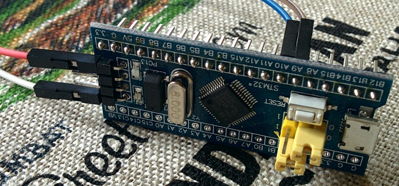
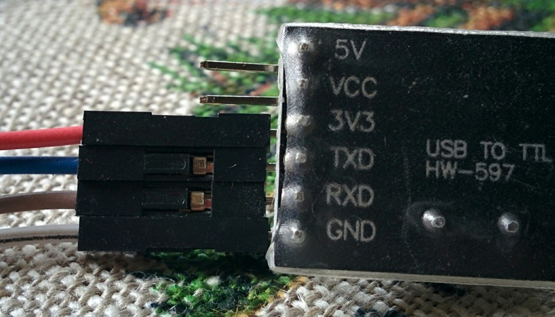

date: 2018-02-22
abstract: My notes on Blue Pill STM32 microcontroller programming with Forth.

# STM32F103C8 tutorial
Originally published on [Github](https://github.com/tocisz/forthplay). Some code samples can be found there too.

## Arduino
There is an STM32 project for Arduino.
Follow [the installation instructions from the project wiki](https://github.com/rogerclarkmelbourne/Arduino_STM32/wiki/Installation).

## Forth

### Flashing with a serial connection

First you need to flash forth. You can use a USB-UART dongle.
Download [stm32loader](https://github.com/jsnyder/stm32loader).
Before use, install: `sudo pip install pyserial`.

Set BOOT0 jumper to 1.

Connect:
```
STM32   PA9  --- RX   UART-USB
        PA10 --- TX
```



Get the flash file from [mecrisp-stellaris](https://github.com/jeelabs/mecrisp-stellaris).

* `mecrisp-stellaris-2.3.9b/stm32f103-ra/*.bin` includes register allocator optimizations
* `mecrisp-stellaris-2.3.9b/stm32f103/*.bin` is smaller, but without optimizations.

```bash
./stm32loader.py -p /dev/ttyUSB0 -e -v -w mecrisp-stellaris-stm32f103.bin
```

### Connecting

`picocom` can do the job:
```bash
picocom -b 115200 --imap lfcrlf /dev/ttyUSB0
```

But `folie` is more comfortable.
You can get it from [the GitHub releases page](https://github.com/jeelabs/folie/releases).

### Installing USB on the microcontroller

A lot of Forth code can be found in [this repository](https://github.com/jeelabs/embello/tree/master/explore/1608-forth).

See [here](https://github.com/jeelabs/embello/tree/master/explore/1608-forth)
for a list of directories.

Most important now is [suf](https://github.com/jeelabs/embello/tree/master/explore/1608-forth/suf)
which will allow programming the microcontroller without USB-UART connector.

* run `folie`
* `!cd ..../explore/1608-forth/suf`
* `!s f-common.fs`

Now you should be able to connect to the microcontroller directly with USB.

### Removing unwanted code

With `f-common.fs` comes a lot of code thay may not be necessary, e.g. the display
driver and fonts. These can be removed. Read [the article about cornerstones](https://jeelabs.org/article/1718a/).
