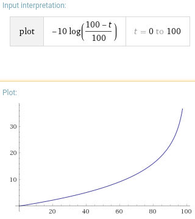

date: 2018-03-04
abstract: Motion equations for stepper revisited.

# Constant acceleration revisited
## What is wrong?
In [the last article](003-Digital-pendulum) the first section is about constant
acceleration... But is it really?

The rule is to change delay for each step to be e.g. 0.9 of delay for previos
step.
$$ \Delta t_{i+1} = 0.9 \Delta t_i $$

Continuous function that satisfies this equation is e.g. (starting from 10ms delay)
$$ t' = 10 (0.9)^x $$
Which is almost equal to
$$ t' = 10 e^{-{x \over 10}} $$

By integrating this with assumption that \\(t(0) = 0\\), we get
$$ t = 100 - 100 e^{-{x \over 10}} $$
By solving for \\(x\\) we get
$$ x = -10 \ln {{100 - t} \over 100} $$

This is not a quadratic eqaution that I expected for constant acceleration!
Moreover it goes to \\(\infty\\) for \\(x \rightarrow 100\\).

Why is that? When delay becomes shorter, we execute more steps in an unit of time.
Motor accelerates with each step, so when delay becomes shorter it accelerates
more quickly.

## How to really get constant acceleration
Let's say we have
$$ x = a t^2 $$
Solving it for \\(t\\) gives
$$ t = \sqrt {x \over a} $$
By calculating derivative we get
$$ t' = {1 \over {2 \sqrt {a x}}} $$

I calculated it in Forth as [before](003-Digital-pendulum) I did for pendulum
movement and now my stepper is really accelerating nicely.

As usually, [source code is on GitHub](https://github.com/tocisz/forthplay/commit/e02fd5388582c144488917e9b2358a914b5311b0).
