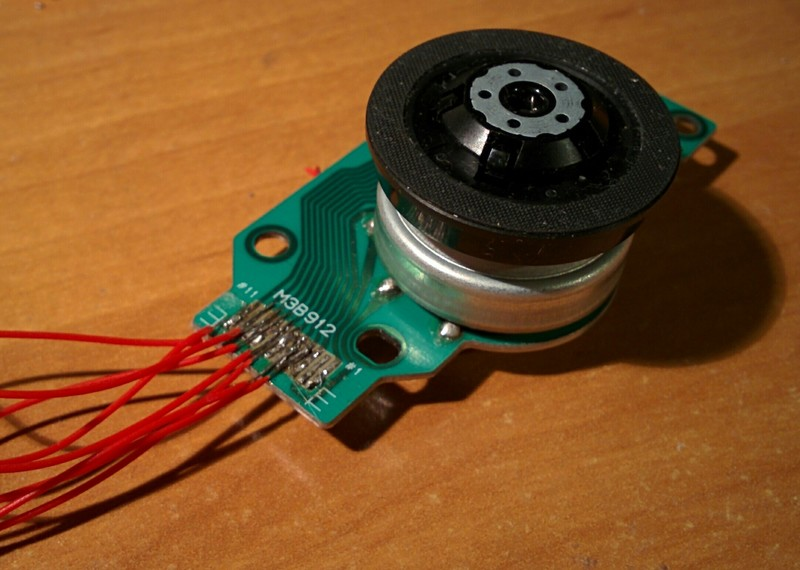

date: 2018-03-10
abstract: Some fun with motor from broken CD-ROM.

# Hall effect sensors
Today's edition of my scrap electronic series is about
[hall effect](https://en.wikipedia.org/wiki/Hall_effect) sensors.
These sensors detect magnetic field and are very practical when position of
some mechanical elements needs to be detected contactlessly.

You can find them in CD/DVD drives. The main motor that rotates CD/DVD disc
is so called brushless DC motor. From the operating point of view it is similar
to a stepper motor with a big step of 30 degrees (only 12 steps per full revolution).
The particular type that I found in my scrap DVD has 3 inputs to drive the motor.


To drive it effectively a motor control circuit has to put electrical current
trough 2 out of 3 inputs in the right sequence, e.g.:
```
  0 1 2 3 4 5 0 1 2 3 4 5 ...
A +   - -   + +   - -   + ...
B - -   + +   - -   + +   ...
C   + +   - -   + +   - - ...
```
For more explanation see [this youtube video](https://youtu.be/ZAY5JInyHXY).

But how does a control circuit of a motor know what is the position of the rotor
and when it's the best time to switch to the next step in the sequence?
Hall effect sensors can be used for that.

The little black chip below motor labeled HU is one of three sensors that I
found in my BLDC motor.
Very conveniently rotor of the motor has magnets around it, so its position can
be detected by these little sensors.


The hardest part was connecting to it. Soldering thin wire with a simple soldering
iron and my lack of skills was not promising any success.
As you can see on the first photo it looks ugly. But somehow it works...

Usually two outputs of hall effect sensor are compared by comparator circuit
and there is only one binary output from it. But each of these sensors has 4 pins.
Two of them are shared by all three sensors, so I guess that it's `VCC` and `GND`.
The other two I connected to ADC on the microcontroller.

I noticed that when I rotate the motor and one of the outputs is increasing voltage
than the other is decreasing voltage. So as a reading from the sensor I take
a difference of readings of two outputs. Below is a complete program I used
to get the readings:

```forth
adc-init
adc-calib

\ execute passed fn in 20 ms cycle until key is pressed
: cycle ( fn -- )
  begin
    cr
    20 ms
    dup execute
  key? until
  drop
;

: probe-ad ( -- )
  PA0 adc PA1 adc - .
  PA2 adc PA3 adc - .
  PA4 adc PA5 adc - .
;

' probe-ad cycle
```

Here is a plot of the readings I got when rotating motor manually.
It looks like it can actually give quite a good precision. Much more
than 30 degrees resolution one can get by reading sensors trough comparator
as a digital input (as far as I know that's how it's usually used).


*Question 1.*

How many RPMs was I doing?

*Question 2.*

Has STM32 possibility to make an interrupt by comparing two analog inputs?
If it has, it should be easy to write a logic that keeps track of motor position.
With it the motor could be used as a control wheel for some user interface.
I leave this as an easy exercise to the reader ;-)
...and please send me the code!
