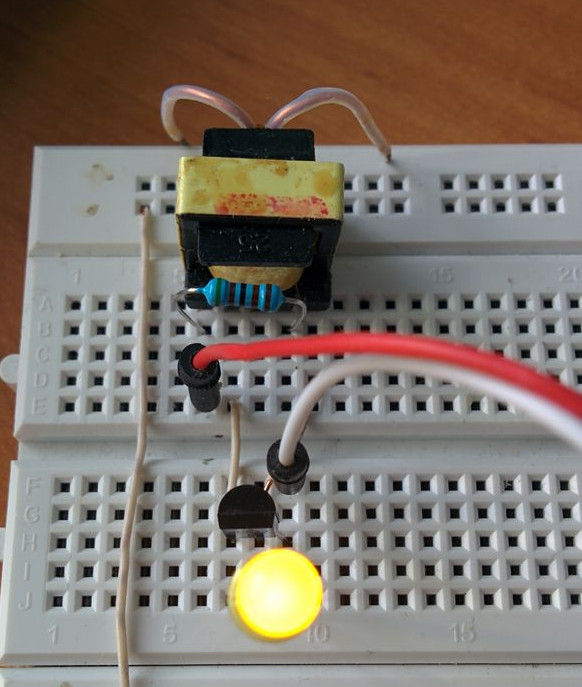

date: 2018-04-04

# Joule thief

Citing [Wikipedia](https://en.wikipedia.org/wiki/Joule_thief):
> A joule thief is a minimalist self-oscillating voltage booster that is small, low-cost, and easy to build,
> typically used for driving small loads. This circuit is also known by other names such as blocking oscillator,
> joule ringer, vampire torch.

The name comes from the fact that the circuit can work even on a battery that
is almost totally depleted (0.7 V is enough).
The best description of the working principle that I found is [here](http://madscientisthut.com/wordpress/daily-blog/joule-thief-simulation-ii/attachment/jtsim/).

It's so easy to build it that I did it just to see it live. Instead of typical
toroid 1:1 transformer I used a transformer unsoldered from a broken phone charger.



Although I used a transformer that is not typical for this circuit and has unknown parameters
it worked correctly.
I was curious about the frequency it generates (Wikipedia states that
usually it's around 50 kHz), so I tried connecting a piezoelectric membrane to it. I couldn't hear
anything, so I concluded that the frequency is greater than 20 kHz or my hearing is bad.

A LED limits voltage generated by this ciruit, so it should be safe to connect it
as an input of a microcontroller...

I wrote a simple program that uses external interrupt to count impulses. It turned out
that the frequency is around 210 kHz, but when I switch transformer windings it goes down to
27.9 kHz. I guess that's expected for not a 1:1 transformer.

On the next day I enhanced the program to record and print input high/low timings.
Here are measured times (in µs):
```
1 1,75
0 2,98
1 1,72
0 3,00
...
1 1,73
0 3,00
```
And here are measured times for switched windings:
```
1 9,68
0 26,19
1 9,69
0 26,19
...
1 9,68
0 26,19
```
The source code is as usually [on Github](https://github.com/tocisz/forthplay/blob/master/exti/exti2.fs).

*Question 1.*

How to use input capture on STM32? Any piece of advice?
