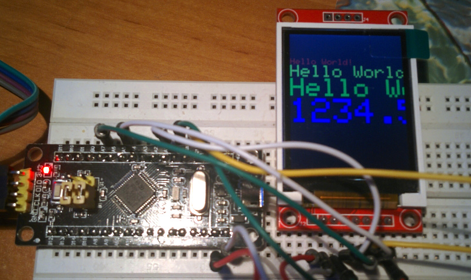
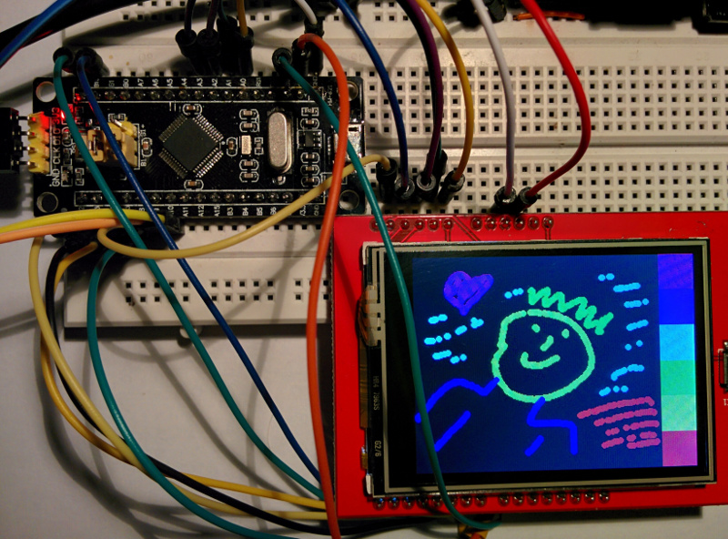

date: 2018-05-10
abstract: Notes about connecting two types of LCD screens to Blue Pill STM32 microcontroller.

# LCD Screens

Nothing really interesting here. I just want to document how to connect two
LCD screens to a blue pill.
Actually it's not a [blue pill](http://wiki.stm32duino.com/index.php?title=Blue_Pill).
It's [black](http://wiki.stm32duino.com/index.php?title=Black_Pill).
Some pins are connected differently. E.g. onboard LED is not on `PC13`,
but on `PB12`.

## ST7735 1.8'' TFT LCD

This one has `128`x`160` resolution.



Connect as follows.

```
STM32  3.3 --- VCC  LCD
       GND --- GND
       AO  --- CS
       A1  --- RESET
       C13 --- AO
       A7  --- SDA
       A5  --- SCK
       3.3 --- LED
```

I used [Adafruit_GFX library](https://github.com/adafruit/Adafruit-GFX-Library)
version [ported to STM32](https://github.com/rogerclarkmelbourne/Arduino_STM32/tree/master/STM32F1/libraries/Adafruit_GFX_AS).
To test it I took example from original Adafruit library and changed pin numbers.

```diff
--- libraries/Adafruit_ST7735/examples/graphicstest/graphicstest.ino	2018-03-30 22:13:14.870036019 +0200
+++ st7735-test/st7735-test.ino	2018-03-31 22:51:22.025625036 +0200
@@ -21,17 +21,17 @@
   MIT license, all text above must be included in any redistribution
  ****************************************************/

-#include <Adafruit_GFX.h>    // Core graphics library
+#include <Adafruit_GFX_AS.h>    // Core graphics library
 #include <Adafruit_ST7735.h> // Hardware-specific library
 #include <SPI.h>


 // For the breakout, you can use any 2 or 3 pins
 // These pins will also work for the 1.8" TFT shield
-#define TFT_CS     10
-#define TFT_RST    9  // you can also connect this to the Arduino reset
+#define TFT_CS     PA0
+#define TFT_RST    PA1  // you can also connect this to the Arduino reset
                       // in which case, set this #define pin to 0!
-#define TFT_DC     8
+#define TFT_DC     PC13 // A0

 // Option 1 (recommended): must use the hardware SPI pins
 // (for UNO thats sclk = 13 and sid = 11) and pin 10 must be
```

## ILI93.. 2.4'' TFT LCD

This one has `320`x`240` resolution and is touch sensitive. Image can be sent
serially or by 8-bit data bus. I used data bus for the speed sake.



Adafruit library port can be found [here](https://github.com/iwalpola/Adafruit_ILI9341_8bit_STM).
It was modified by an author of [this instructable](https://www.instructables.com/id/Fast-Portable-and-Affordable-Oscilloscope-and-Indu/) to use different pins. Unfortunately I couldn't find it on Github.
There is [a zip file to download](https://cdn.instructables.com/ORIG/F93/WPIS/J1CENFTO/F93WPISJ1CENFTO.zip).

An author of the first library admits that [this one](https://github.com/stevstrong/Adafruit_TFTLCD_8bit_STM32) is better.
I'm thinking about porting oscilloscope code to it.

Some documentation about display and drivers can be found [here](http://misc.ws/2013/11/08/touch-screen-shield-for-arduino-uno/).
