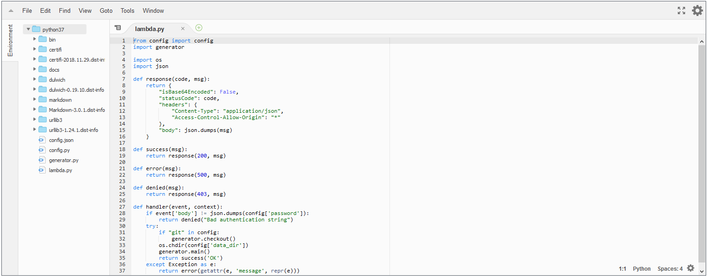

date: 2019-01-24

# Migrating to AWS

This blog [came to life some time ago](000-Hello-world) hosted on cheap server
by PHP engine. My needs are modest and hosting cost was less than $1 per year.
But after a year has passed, hosting company wanted ~$120 for the next year,
so I decided to move.

(I know I could use some blogging service, but I like to have full control,
so again I built something from scratch. I decided to use AWS to explore
some of their services a bit.)

## S3

I guess S3 stands for Scalable Storage Service. First thing I did was `wget`
and upload to S3. In a few minutes I had my site hosted by AWS by just
following short [howto article](https://docs.aws.amazon.com/AmazonS3/latest/dev/WebsiteHosting.html).

Basically all you need to do is to point to index page and error page.


## Route 53

But URL like `http://tomasz-cichocki.pl.s3-website-eu-west-1.amazonaws.com`
is not very nice, so next step is to set up DNS. Route 53 is DNS service
from AWS (and port 53 is...).

AWS won't allow to transfer .pl domain to them, but you can setup hosted zone
in Route 53 anyway and delegate your domain to AWS DNS servers.


When you have your hosted zone, it's easy to create alias records that point
to various other AWS services (S3, CloudFront, API Gateway, ...).
For details see [here](https://docs.aws.amazon.com/AmazonS3/latest/dev/website-hosting-custom-domain-walkthrough.html).

## CloudFront

One problem with S3 static hosting is that it won't handle HTTPS.
There is nothing really secret on my blog site, but I don't want
[Google Chrome to complain that my website is not secure](https://security.googleblog.com/2018/02/a-secure-web-is-here-to-stay.html).

AWS solution for serious content delivery is CloudFront. It can cache and
serve content from S3, ELB (and anything behind it) or media store (for video files).

### Certificate Manager

But to enable HTTPS you first need an SSL certificate.
Public SSL certificates from AWS [are for free](https://aws.amazon.com/certificate-manager/pricing/).
For CloudFront you need a certificate in US East (N. Virginia) region. Yes,
AWS certificates are not global. They need to be created in the region where
they will be used.

If your domain is hosted by Route 53, easiest way to validate a certificate
(prove that you are the owner of a domain) [is by DNS](https://docs.aws.amazon.com/acm/latest/userguide/gs-acm-validate-dns.html).
In this case AWS will automatically create some DNS records for validation purpose.
When certificate is issued you can remove these.

### IAM

Another thing to ensure before CloudFront distribution will work are
permissions.
AWS has elaborate system to manage who is allowed to do what operations on which resources. 
Service that is responsible for permissions
in AWS is IAM, but you can configure policies to grant or revoke permissions
across all AWS services.

CloudFront needs to have permission to read resources in your S3 bucket
(`s3:GetObject` permission for contents of a bucket)
and to list resources in the bucket (`s3:ListBucket` permission for a bucket).
Without second permission CloudFront won't handle correctly requests that should result
in "404 Not Found".

Since there is nothing secret in my S3 bucket easiest thing to do was to grant
`s3:GetObject` and `s3:ListBucket` by setting following policy on S3 bucket:

```json
{
    "Version": "2012-10-17",
    "Statement": [
        {
            "Effect": "Allow",
            "Principal": "*",
            "Action": "s3:ListBucket",
            "Resource": "arn:aws:s3:::tomasz-cichocki.pl"
        },
        {
            "Effect": "Allow",
            "Principal": "*",
            "Action": "s3:GetObject",
            "Resource": "arn:aws:s3:::tomasz-cichocki.pl/*"
        }
    ]
}
```

### Back to CloudFront

Once you have a SSL certificate, it's pretty straight forward to create distribution
for a S3 bucket. As in S3 static hosting there are options to setup
"default root object" (index.html) and error pages (there can be separate
error page for each HTTP error code).

One catch is that once resource is cached in CloudFront it may take 24 hours
to refresh it. To force refresh you can "Create Invalidation" request
(first 1000 requests in a month are for free).


## Moving from PHP to Python

My PHP based solution was simple: I edited and published Markdown files on Github.
There was a `cron` that pulled changes from Github and PHP wrapper
to translate these into HTML when requested.
I wanted to move that part into AWS too.

Using [Jinja2](http://jinja.pocoo.org/) and [Markdown](https://github.com/Python-Markdown/markdown) libraries
it was quite easy to translate
my rudimentary PHP into Python that generates static HTML files.

Thanks to [Dulwich](https://github.com/dulwich/dulwich) library
I could implement Github access easily too.

AWS gives Python API for managing their services, so uploading HTML files
could be easily automated too. S3 API allows to ask only for metadata
that contains checksum of a file, so it's not hard to upload only files
that have changed.

## Lambda

In 2 hours or so I had working Python script that was able to update
my website data in S3. But it's not ideal to setup Python on computer
at hand just to update blog page. Lambda comes to the rescue.

Lambda is AWS service that allows executing short lived computations.
It supports Java, GO, PowerShell, Node.js, Ruby and luckily Python.
I was able to zip my script along with libraries and run it on Lambda.

It has online code editor which is not bad:



Lambda was designed to handle events on AWS and respond to them.
There are numerous possible events, e.g. VM running out of memory,
new S3 resource uploaded, update in DynamoDB database, etc.

## API Gateway

API Gateway is yet another service from AWS. It's sole purpose is calling Lambda.
It can call Lambda when HTTP (or WebSocket) request comes from the internet
and respond with returned data.


This task seems simple, but again it's necessary to create SSL certificate
and set up subdomain in Route 53.

After taking care of the above I wrote some JS to be able to refresh my blog
when I enter correct password on hidden site... and it was not working :-).
The problem was that API lives on `https://api.tomasz-cichocki.pl/` and
JS lives on `https://tomasz-cichocki.pl/`, so modern browsers block
JS from accessing resources on different site.
That's how I learned what [CORS](https://en.wikipedia.org/wiki/Cross-origin_resource_sharing) is.
After setting it in API Gateway finally everything works.

## How much it costs?

Well, there is yet another AWS service to check that: [AWS Cost Explorer](https://docs.aws.amazon.com/awsaccountbilling/latest/aboutv2/ce-what-is.html).
Some services are for free (public SSL certificates), most have free quota.
Since this elite blog is not very popular, I only pay for DNS
and it costs $6 for year for a domain.


But please don't refresh page too often ;-).

## Conclusions

AWS is lots of services. At first it's easy to get lost. But AWS services
try to do one simple thing right and combine well. After some time spent
with them it seems natural to use

`Route 53 | (CloudFront | S3 && Api Gateway | Lambda | DynamoDB )`

just as you do

`cat ... | grep ... | xargs whatever`
