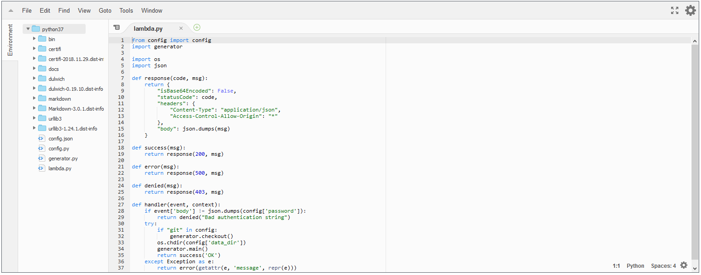

date: 2019-02-07
abstract: A few improvements in blog engine. Syntax coloring, RSS and more.

# Improvements in the blog engine

In [the last blog entry](008-Migrating-to-AWS) I was writing how I generate pages of this blog with Python scripts running on AWS Lambda. Since that time I did a few improvements. I will shortly write about them in this follow up article.

## Layers of lambda

When you look at the picture from the last article showing Lambda code editor you can see big mess in the left pane. There are many directories of external libraries visible. What's worse, saving Lambda takes a lot of time. What's even worse, when I added one more library for syntax highlighting, I have reached the limit and visual editor was disabled.

_Why Amazon did unusable editor? Am I doing something wrong?_ I was asking myself. And soon I found solution. It's better to use layers to store libraries. These can be uploaded once and shared by many Lambda functions. When using layers to store libraries there is no problem with the editor.

## Syntax highlighting

For markdown I use... [Markdown](https://github.com/Python-Markdown/markdown) library. It has extensions mechanism and one of the extensions does syntax highlighting. Actually, it integrates [Pygments](http://pygments.org) library to do the job. I was surprised to see that it supports Forth highlighting out of a box!

## RSS feed

On my phone I use RSS aggregator to follow a few of my favorite feeds. If you also like RSS feeds, now you can stay up to date with my blog!

For this I use [rfeed](https://github.com/svpino/rfeed) library.

## Final thoughts
I like what I did ;-). If you would like to create similar approach for creating website, as usually, [the code is on GitHub](https://github.com/tocisz/homepage-generator).