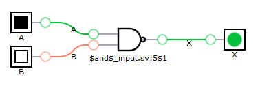
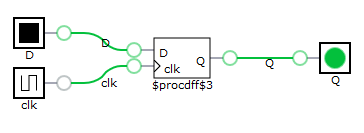
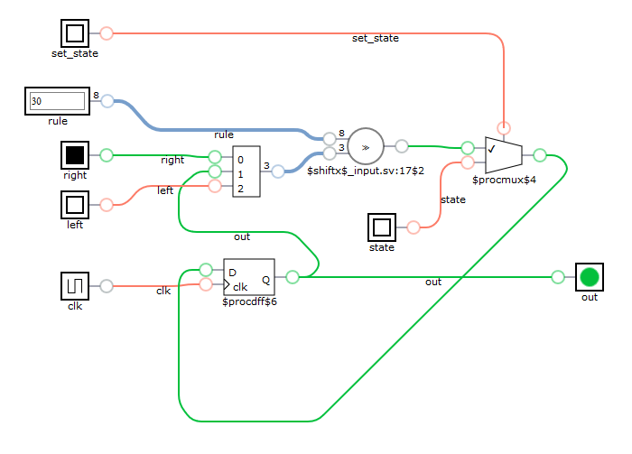
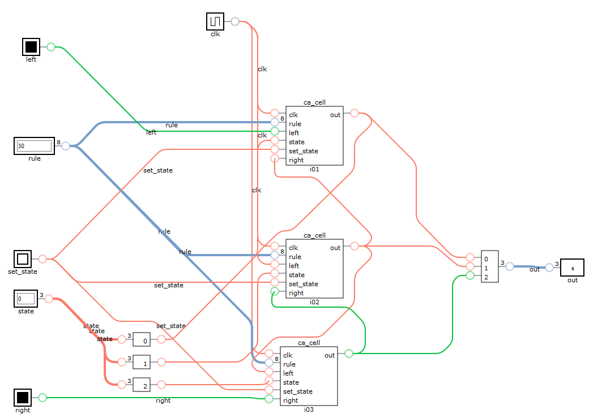

date: 2019-02-10
abstract: Short introduction to Verilog written by someone who doesn't know it.
redirect_from: 010-Learning-basics-of-Verilog

# Learning basics of Verilog with Verilator and DigitalJS

***What is Verilog?***

To cite [Wikipedia](https://en.wikipedia.org/wiki/Verilog):
> Verilog, standardized as IEEE 1364, is a hardware description language (HDL) used to model electronic systems. It is most commonly used in the design and verification of digital circuits at the register-transfer level of abstraction.

***What is Verilator?***

To cite authors of [Verilator](https://www.veripool.org/wiki/verilator):
> Verilator is the fastest free Verilog HDL simulator, and outperforms most commercial simulators. Verilator compiles synthesizable SystemVerilog (generally not test-bench code), plus some SystemVerilog and Synthesis assertions into single- or multithreaded C++ or SystemC code.

***What is DigitalJS?***

To cite [Tilk](http://www.tilk.eu/) who is an author of [DigitalJS](https://github.com/tilk/digitaljs):
> DigitalJS is a digital circuit simulator implemented in Javascript. It is designed to simulate circuits synthesized by hardware design tools like [Yosys](http://www.clifford.at/yosys/), and it has a companion project [yosys2digitaljs](https://github.com/tilk/yosys2digitaljs), which converts Yosys output files to DigitalJS. It is also intended to be a teaching tool, therefore readability and ease of inspection is one of top concerns for the project.

## Modules

Verilog module is a reusable black box with inputs and outputs.
Module has name, and generally it should have both inputs and outputs:
```verilog
module our;
  input  A;
  output X;

  ...
endmodule
```

Modules can be

* stateless &ndash; in that case output depends only on inputs;
* stateful  &ndash; when module has internal state that can change.

We will start our Verilog exploration by looking at stateless modules.

## Combinatorial logic
Stateless modules are used to compute combinatorial logic.
Let's define module that calculates NAND logic function.

First, let's look at Verilog code:

```verilog
module top(X, A, B);
  input   A, B;
  output  X;

  assign  X = ~(A & B);
endmodule
```

To check our first module, we can go to [Yosys2digitaljs](http://digitaljs.tilk.eu/) web application,
paste Verilog code, and we get synthesized circuit visualization.
Just a NAND gate.



To test it with Verilator, we need C++ (or SystemC, but I'll stick with C++) code
to run simulation:
```c++
#include <iostream>

#include "Vtop.h"

int main(int argc, char **argv, char **env) {
  Verilated::commandArgs(argc, argv);

  // init top verilog instance
  Vtop top;

  for (int a = 0; a < 2; ++a) {
    for (int b = 0; b < 2; ++b) {
      top.A = a;
      top.B = b;
      top.eval();

      std::cout << "a=" << a
        << " b=" << b
        << " x=" << (int)top.X
        << std::endl;

      if (Verilated::gotFinish()) exit(0);
    }
  }

  exit(0);
}
```
To run it we need to execute 3 steps:
```bash
verilator -Wall --trace --cc top.v --exe top.cpp # generate c++ code from verilog
make -C obj_dir -j -f Vtop.mk Vtop # compile c++ code
obj_dir/Vtop # run it
```
The outcome is correct:
```
a=0 b=0 x=1
a=0 b=1 x=1
a=1 b=0 x=1
a=1 b=1 x=0
```

Something to remember, but I don't want to elaborate on that:

* `assign` statements are not sequential. It makes no sense to overwrite previously defined value.
  All assigns should create directed graph from inputs to outputs with no cycles.
* There are tasks and functions in Verilog (useful to include).
* There are `inout` module ports.

### Types and Expressions

Verilog defines a single base data type which has the following four values:

* 0 - represents a logic zero or false condition
* 1 - represents a logic one or true condition
* X - represents an unknown logic value
* Z - represents high-impedance state

Basic operators are similar to C operators, but [there are more](http://www.asic-world.com/verilog/verilog_one_day1.html#Operators).

Variables can be vectors consisting of many base data type values. By using
vectors of 4 bits we can transform previous example to parallel computation:

```Verilog
module top(X, A, B);
  input [3:0] A;
  input [3:0] B;
  output [3:0] X;

  assign  X[3:0] = ~(A[3:0] & B[3:0]);
endmodule
```

And test it with C++ code:
```C++
#include <iostream>
#include <bitset>

#include "Vtop.h"

int main(int argc, char **argv, char **env) {
  Verilated::commandArgs(argc, argv);

  // init top verilog instance
  Vtop top;

  top.A = 0b0011;
  top.B = 0b0101;
  top.eval();
  std::cout << "a=" << std::bitset<4>(top.A) << std::endl
    << "b=" << std::bitset<4>(top.B) << std::endl
    << "x=" << std::bitset<4>(top.X) << std::endl;

  exit(0);
}
```
Getting resut:
```
a=0011
b=0101
x=1110
```

### Logic gates
Alternatively, we can define our NAND module by combining logic gates.
There are built it modules for basic logic gates (`and`, `or`, `not`, ...) that
can be combined this way. There is `nand` gate too, but we won't use it.

```verilog
module top(X, A, B);
  input   A, B;
  wire W;
  output  X;

  and and1 (W, A, B);
  not not1 (X, W);
endmodule
```

Worth noting:

* `wire W` above it something new. This defines internal connection point that
  it neither input nor output.
* `and and1 (W, A, B)` instantiates gate `and` and gives its instance name `and1`.
  It has `A` and `B` as inputs and `W` as output.
* `not not1 (X, W)` instantiates gate `not` ...

Logic gates work on vectors too. I guess gates are generic modules that work
for any vector length:
```verilog
module top(X, A, B);
  input [3:0] A;
  input [3:0] B;
  wire  [3:0] W;
  output [3:0] X;

  and and1 (W, A, B);
  not not1 (X, W);
endmodule
```

By the way, this technique can be used to combine any modules, not just logic gates.

## Sequential logic

To create so called _sequential logic_ we need state in our module.
We already know `input`, `output` and `wire` module declarations.
One more that we will need is `reg`, as in register. And indeed, `reg`
declarations can be used to create registers that store value.

Once we have `reg` declaration, we need to tell when it will change value.
To do this, we can use `always @(conditions)` block. Usually we want
value to change on edge of a clock cycle. E.g. we can use
`always @(posedge clk)` to change state of some registers at positive edge
(change from 0 to 1) of `clk` signal. Similarly, we can use `always @(negedge clk)` to change
value at negative edge of `clk` signal. `always` block will be evaluated
at any change of signal if we skip `posedge` and `negedge` keyword.

Let's consider simplest possible example:
```Verilog
module register(Q, D, clk);
  input   D, clk;
  output  Q;
  reg     Q;

  initial
  begin
    Q = 0;
  end

  always @(posedge clk)
  begin
    Q <= D;
  end
endmodule
```

Synthesis gives a single [D-type filp-flop](http://electronics-course.com/d-flip-flop).

 

To see how it works, let's write simple test code:
```C++
void print(Vregister& top, int i) {
  std::cout << "i=" << i
    << " clk=" << (int)top.clk
    << " D=" << (int)top.D
    << " Q=" << (int)top.Q
    << std::endl;
}

int main(int argc, char **argv, char **env) {
  ...

  top.clk = 1;
  top.D = 0;
  top.eval();
  print(top, 0);

  top.D = 1;
  top.eval();
  print(top, 1);

  top.clk = 0;
  top.eval();
  print(top, 2);

  top.D = 0;
  top.eval();
  print(top, 3);

  top.D = 1;
  top.eval();
  print(top, 4);

  top.clk = 1;
  top.eval();
  print(top, 5);

  ...
}
```

An outcome is:
```
i=0 clk=1 D=0 Q=0
i=1 clk=1 D=1 Q=0
i=2 clk=0 D=1 Q=0
i=3 clk=0 D=0 Q=0
i=4 clk=0 D=1 Q=0
i=5 clk=1 D=1 Q=1
```

As we can see, state of `Q` has not changed until `i=5`, despite `D` has changed
several times and `clk` has changed once (but from positive value to negative).

You may have noticed `<=` in `always` block. It is the same as _less or equal_ operator,
but in this contexts it is _nonblocking assignment_. It can be used only in `always` blocks.
Normal assignment (so called _blocking assignment_) can be used in `always`
blocks too, but _nonblocking assignment_ should be used for assigning computed value to port
or register. For details, [see this article](http://www.sunburst-design.com/papers/CummingsSNUG2000SJ_NBA.pdf).

## An example: cellular automata

In this example we will write Verilog code that can simulate 1D [cellular automata](https://en.wikipedia.org/wiki/Cellular_automaton). Surprisingly, even 1D automata, in which state of a cell depends only on its state and
state of two neighboring cells, can generate interesting patterns. When state is binary, there are only
$$2^{2^3} = 256$$ possible rules for 1D automata. The most famous is [rule 30](https://en.wikipedia.org/wiki/Rule_30), so we will use it for testing.

### Single cell

We want cells to operate in phases, so we have `clk` signal
that is used for synchronization.

Single cell needs only 1 bit of internal state and this state is visible
as an output. This is `reg out` below.
(I noticed that `output x` and `reg x` declarations
 can be combined into one declaration and written as `output reg x`,
 which is more readable.)

We give 8 bit `rule` on input &ndash; our cells will be universal.

We need to give state of neighboring cells (`left` and `right` inputs).

Finally, we have ability to give initial state of the cell. This can be
done by setting `set_state=1` and giving `state` value.

Logic is very simple. Value of `out` register can change only on positive
edge of `clk` signal:

* if `set_state=1`, internal state is set to given `state`;
* if `set_state=0`, we look at number described by concatenated
  `right`, `out` and `left` values. This number gives position in `rule`
  vector that should be used as output.

```Verilog
module ca_cell(clk, out, rule, left, state, set_state, right);
  input wire       clk;
  input wire [7:0] rule;

  input wire       left;
  input wire       right;

  input wire       state;
  input wire       set_state;

  output reg       out;

  always @ ( posedge clk ) begin
    if (set_state)
      out <= state;
    else
      out <= rule[{right,out,left}];
  end

endmodule
```

Synthesis result is pretty much what I expected. We can see

* D filp-flop to store state
* multiplexer to set given state or calculated state
* something named shiftx, what I expected also to be multiplexer,
  but maybe some sort of shift register can be used instead.



To test single cell, I wrote C++ test case, which is too boring to cite.
Believe me, it works just fine.

### Connecting cells

All we need to get working cellular automaton is connecting cells by wires.
Connecting 8 cells is a bit lengthy, but super-simple:

```Verilog
module ca2(clk, out, rule, left, state, set_state, right);
  input wire       clk;
  input wire [7:0] rule;

  input wire       left;
  input wire       right;

  input wire [7:0] state;
  input wire       set_state;

  output wire [7:0] out;

  ca_cell i01(
    .clk(clk),
    .rule(rule),
    .set_state(set_state),
    .state(state[0]),
    .out(out[0]),

    .left(left),
    .right(out[1])
  );

  ca_cell i02(
    .clk(clk),
    .rule(rule),
    .set_state(set_state),
    .state(state[1]),
    .out(out[1]),

    .left(out[0]),
    .right(out[2])
  );

  ca_cell i03(
    .clk(clk),
    .rule(rule),
    .set_state(set_state),
    .state(state[2]),
    .out(out[2]),

    .left(out[1]),
    .right(out[3])
  );

  ca_cell i04(
    .clk(clk),
    .rule(rule),
    .set_state(set_state),
    .state(state[3]),
    .out(out[3]),

    .left(out[2]),
    .right(out[4])
  );

  ca_cell i05(
    .clk(clk),
    .rule(rule),
    .set_state(set_state),
    .state(state[4]),
    .out(out[4]),

    .left(out[3]),
    .right(out[5])
  );

  ca_cell i06(
    .clk(clk),
    .rule(rule),
    .set_state(set_state),
    .state(state[5]),
    .out(out[5]),

    .left(out[4]),
    .right(out[6])
  );

  ca_cell i07(
    .clk(clk),
    .rule(rule),
    .set_state(set_state),
    .state(state[6]),
    .out(out[6]),

    .left(out[5]),
    .right(out[7])
  );

  ca_cell i08(
    .clk(clk),
    .rule(rule),
    .set_state(set_state),
    .state(state[7]),
    .out(out[7]),

    .left(out[6]),
    .right(right)
  );
endmodule
```

For sake of readability I will visualize only three cells connected:



Now we can set it up and cycle clock in a loop to see how it evolves:

```C++
void print(Vca2& top, int i) {
    std::cout << "i=" << i
      << "\tout=" << std::bitset<8>(top.out)
      << std::endl;
}

void testCa2() {
  std::cout << "Testing ca2" << std::endl;
  int count = 0;
  Vca2 ca;

  ca.clk = 0;
  ca.rule = 30; // use rule 30
  ca.set_state = 1;
  ca.state = 16; // 00010000
  ca.eval();

  ca.clk = 1;
  ca.eval();
  print(ca, ++count);

  ca.set_state = 0;
  ca.left = 0;
  ca.right = 0;

  while (count < 10) {
    ca.clk = 0;
    ca.eval();

    ca.clk = 1;
    ca.eval();
    print(ca, ++count);
  }

}
```
Which gives expected outcome:
```
Testing ca2
i=1     out=00010000
i=2     out=00111000
i=3     out=01001100
i=4     out=11110110
i=5     out=00010011
i=6     out=00111101
i=7     out=01000101
i=8     out=11101101
i=9     out=00100101
i=10    out=01111101
```

### More cells

It would be nice to be able to generate cells and connections by some kind of
loop, wouldn't it? It is possible indeed.

```Verilog
module ca3(clk, out, rule, left, state, set_state, right);
  parameter WIDTH = 32; // modules can be parameterized

  input wire       clk;
  input wire [7:0] rule;

  input wire       left;
  input wire       right;

  input wire [WIDTH-1 : 0]  state;
  input wire                set_state;

  output wire [WIDTH-1 : 0] out;

  genvar i;
  generate
  for (i=0; i < WIDTH; i=i+1)
    ca_cell ith(
      .clk, // when name of port is the same as name of wire/reg, argument can be omitted
      .rule,
      .set_state,
      .state(state[i]),
      .out(out[i]),

      .left(i == 0 ? left : out[i-1]), // conditionals are allowed in generate block
      .right(i == WIDTH-1 ? right : out[i+1])
    );
  endgenerate

endmodule
```

Code is shorter and simulation now gives bigger, nicer result:

```
Testing ca3
i=1     out=00000000000000010000000000000000
i=2     out=00000000000000111000000000000000
i=3     out=00000000000001001100000000000000
i=4     out=00000000000011110110000000000000
i=5     out=00000000000100010011000000000000
i=6     out=00000000001110111101100000000000
i=7     out=00000000010010000100110000000000
i=8     out=00000000111111001111011000000000
i=9     out=00000001000001110001001100000000
i=10    out=00000011100010011011110110000000
i=11    out=00000100110111101000010011000000
i=12    out=00001111010000101100111101100000
i=13    out=00010001011001100111000100110000
i=14    out=00111011001110111001101111011000
i=15    out=01001001110010001110100001001100
i=16    out=11111110011111010010110011110110
i=17    out=00000011100001011110011100010011
i=18    out=00000100110011000011100110111101
i=19    out=00001111011101100100111010000101
i=20    out=00010001000100111111001011001101
```

## Conclusions

For me, it was fun to learn over a weekend basics of a language that is quite different
than anything I knew. I have some cheap FPGA that waits for its first use.
I have heard that generating VGA output is simple with FPGA, so maybe scrolling
cellular automata simulation is something to do... :-)

As usually, source code [is on GitHub](https://github.com/tocisz/verilog-cellular-automaton).
