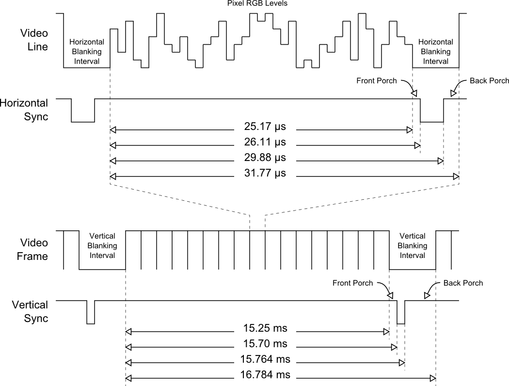

date: 2019-08-06
abstract: Generating VESA signal of cellular automaton by FPGA.

# VESA output by FPGA

In the [last article](011-Programming-Xilinx-Spartan-6) I described how to simulate cellular automata on FPGA. The result wasn't spectacular &ndash; only some LEDs flashing. Soon after that I wanted to see more cells, so I decided to generate VESA output.

## How VESA works?

VESA signals were designed to be used with [CRT](https://en.wikipedia.org/wiki/Cathode-ray_tube). In this scary technology that was widely used when I was a kid, electron beam is magnetically deflected to scan surface of phosphorescent screen.

The beam travels from left to right to draw a line (by exciting phosphorescent layer of the screen).
Than it goes back to left side of the screen and a bit down. Than it draws next line and so on. As a result it goes from top to the bottom. When it reaches bottom of the screen it goes back to the top.

There are five signals used:

* R - intensity of red at current position of a beam
* G - intensity of green
* B - intensity of blue
* HSync - horizontal synchronization
* VSync - vertical synchronization

R, G, B signals are analog. HSync and VSync signals are digital.

HSync signal was used to mark time when electron beam goes back to the beginning of a scanline. Similarly, VSync was used to mark time when beam goes back to top of a screen. This can be visualized by following timing diagram:



Timings vary from one VESA mode to another. I decided to use [1280x1024@60](http://tinyvga.com/vga-timing/1280x1024@60Hz) mode,
because that's resolution of my old LCD screen.

## Top module

### Inputs and outputs

I use 50 MHz external clock input and generate VESA signals:

```Verilog
module top (
  input  wire clk50,
  output wire vga_h_sync,
  output wire vga_v_sync,
  output reg  vga_R,
  output reg  vga_G,
  output reg  vga_B
);
```

I said before that R, G, B signals are analog... I drive them with digital output, so I can use only 8 colors.

### Clock signals

Specification of [1280x1024@60](http://tinyvga.com/vga-timing/1280x1024@60Hz) mode says that pixel frequency is 108.0 MHz.
I used clock synthesis capabilities of my FPGA to get as close as possible to this frequency. By multiplying frequency times 13 it
goes up to 650 MHz, than it is divided by 6 to go down to 108.333... MHz.

I also generate clock signal of the same frequency, but phase shifted by 180 degrees (`clkps` below). This will be useful for driving memory.

```Verilog
wire clk;
wire clkps;
clkdiv clkdiv
(
	.CLK_IN1(clk50),
	.CLK_OUT1(clk),
	.CLK_OUT2(clkps)
);
```

`clkdiv` above is an instance of a standard Spartan module that can be used for clock synthesis.

### Synchronization

I use separate module to generate `vga_h_sync` and `vga_v_sync` outputs.
It also generates `CounterX` and `CounterY` data lines that tell which
pixel is being displayed. `inDisplayArea` and `inPrefetchArea` are helper signals and I will tell more about them later.

```Verilog
wire inDisplayArea;
wire inPrefetchArea;
wire [10:0] CounterX;
wire [10:0] CounterY;
sync_gen_1024x1080 syncgen
(
  .clk(clk),
  .vga_h_sync(vga_h_sync),
  .vga_v_sync(vga_v_sync),
  .inDisplayArea(inDisplayArea),
  .inPrefetchArea(inPrefetchArea),
  .prefetchCounterX(CounterX),
  .counterY(CounterY)
);
```

### Memory

I use static memory built in on FPGA chip to store pixel data for current line and next line of the image.

```Verilog
my_ram image_ram (
  .clka(clkps), // input clka - has to be shifted from clock that generates data and address
  .ena(filler_read || gen_read), // input ena
  .addra(filler_read ? filler_addr : gen_raddr), // input [9 : 0] addra
  .douta(rdata), // output [15 : 0] douta
  .enb(gen_write || rst_write),
  .addrb(gen_write ? gen_waddr : rst_waddr),
  .dinb(gen_write ? gen_wdata : rst_wdata)
);
```

### RGB signals

Current line is being read by `filler` module and sent to RGB signals.

```Verilog
wire        filler_read;
wire  [9:0] filler_addr;
wire [15:0] rdata;
assign filler_addr[9:8] = 0;
two_lines filler
(
    .clk(clk),
    .CounterX(CounterX),
    .CounterYparity(CounterY[0]),
    .inDisplayArea(inDisplayArea),
    .inPrefetchArea(inPrefetchArea),
    .read(filler_read),
    .addr(filler_addr[7:0]),
    .data(rdata),
    .image(image)
);

always @(posedge clk)
begin
  vga_R <= image & inDisplayArea; // one cycle of delay
  vga_G <= image & inDisplayArea; // (because we want no logic after reading signal from register to minimize output delay)
  vga_B <= image & inDisplayArea;
end
```

### Image generation

Next line is computed from previous line by a process simulating cellular automaton when RGB data are not being sent (front porch, HSync and back porch).

```Verilog
wire gen_read;
wire gen_write;
wire [9:0]  gen_raddr;
wire [9:0]  gen_waddr;
wire [15:0] gen_wdata;
assign gen_raddr[9:8] = 0;
assign gen_waddr[9:8] = 0;
ca_gen gen
(
	.clk(clk),
	.start(CounterY < 11'd 1023 && CounterX == 11'd 1296),
	.direction(CounterY[0]),
	.read(gen_read),
	.raddr(gen_raddr[7:0]),
	.rdata(rdata),
	.write(gen_write),
	.waddr(gen_waddr[7:0]),
	.wdata(gen_wdata)
);
```

### First line

There is separate process to initialize first line of the image. I initialize it with a single white pixel that moves from left to right.

```Verilog
wire rst_write;
wire [9:0]  rst_waddr;
wire [15:0] rst_wdata;
assign rst_waddr[9:8] = 0;
ca_gen0 reset (
    .clk(clk),
    .start(CounterY == 11'd 1023 && CounterX == 11'd 1296),
    .write(rst_write),
    .waddr(rst_waddr[7:0]),
    .wdata(rst_wdata)
);
```

## Dive in

### First line

Process that generates first line of the image is wired to memory
module by `rst_write`, `rst_waddr` and `rst_wdata` output lines.

As input lines it gets clock signal (`clk`) and `start` signal
that is activated at some point of time after last line
and before first line of the next frame.

```Verilog
module ca_gen0(
	input wire         clk,
	input wire         start,
	output reg         write,
	output reg  [7:0] waddr,
	output reg  [15:0] wdata
);
```

Its internal state consists of `cycle` (current internal clock cycle)
and `position` registers.

```Verilog
reg [10:0] position;
initial position = 0;

reg [7:0] cycle;
initial begin
	cycle = 8'd 160;
	wdata = 16'b0;
	waddr = 8'b0;
end
```

When `start` signal comes, `cycle` is initialized to 0 and `position` is incremented modulo 1280 (we have 1280 pixels in a line).

```Verilog
if (start)
begin
  wdata <= 16'b0;
  write <= 0;
  cycle <= 0;
  position <= (position + 1'b1) % 1280;
end
```

Before `cycle` reaches its final value of 160 (this is how many 16bit
memory writes are necessary to initialize used memory area) it
sets `write` to 1, increments `cycle` and writes some data to
`wdata` bus. `cycle` is being copied to `waddr`. All of this happens
at positive edge of a clock.

```Verilog
always @ ( posedge clk )
begin
	if (cycle != 8'd 160)
	begin
		if (cycle == position[10:4])
			wdata <= (1 << 15-position[3:0]);
		else
			wdata <= 16'b0;
		write <= 1;
		waddr <= cycle;
		cycle <= cycle + 1'b1;
	end
  ...
```

It is important to note that clock for memory module is phase shifted
by 180 degrees. This gives some time for signals to stabilize before positive edge of memory clock signal comes.

### Image generation
