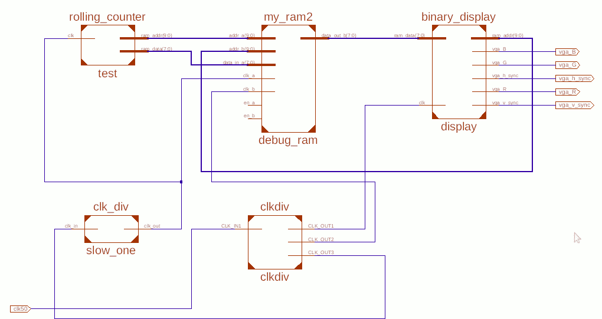
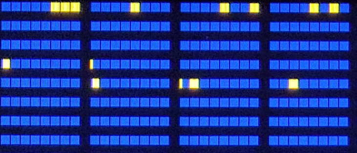
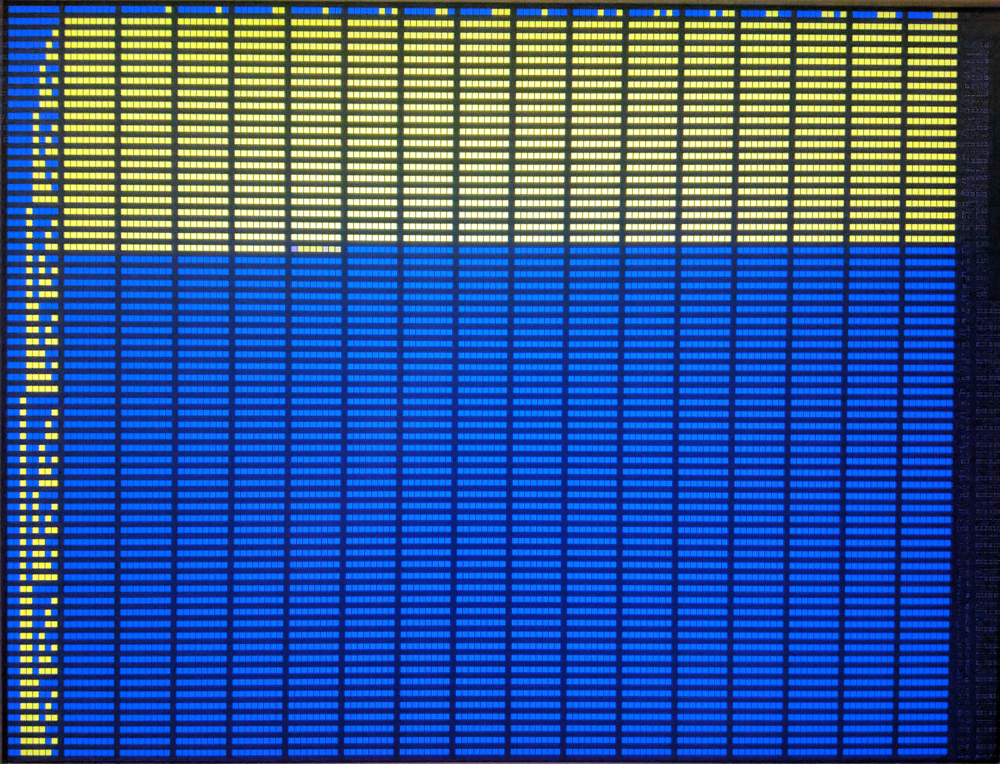

date: 2019-10-24
abstract: How to show 1kB of FPGA memory on LCD screen?

# Binary numeric screen mode

I always liked the looks of PDP-8 front panel.

You can stop processor at any moment, inspect registers and memory, single step it, etc.
It can show contents of registers by turning on and of series
of lamps (I think these are not LEDs...). Of course you have to read it binary.

Blinking LEDs when some condition is met is a well known method of FPGA debugging.
It's not the best method, but a simple one. But why use some LEDs, when
[I have whole LCD screen connected](012-VESA-output-by-FPGA)?

Inspired by blinking lights of old computers I decided to create binary digital
screen mode for my FPGA. The idea is to display contents of memory on a screen,
grouped by bytes, with virtual lights. To make locating interesting bytes
easier I also added row numbers and column numbers.

## Top level view

This project is similar to [previous one](012-VESA-output-by-FPGA),
so I was able to reuse some of its modules:

* I also needed to [generate VGA synchronization signals](012-VESA-output-by-FPGA#Synchronization)
* and to [generate right clock frequency](012-VESA-output-by-FPGA#Clock signals).

Let's look how modules are connected:

External clock signal goes to `clkdiv` module, where it is scaled up to 108 MHz,
because that frequency is needed by `display` module. Second output signal is also 108 MHz,
but it is phase shifted by 180&deg;. This one goes to `debug_ram` module.
Third has the same frequency as input clock and goes to clock frequency divider
(`slow_one` module) where it is scaled down significantly. Slow clock signal
goes to the module being debugged (`test`) and also to `debug_ram`.

Did you notice that `debug_ram` gets two clock signals? This is dual port RAM
with two independent ports. Port `A` is used by `test` module. It puts some debug
data into the RAM. Port `B` is used by `display` module. It reads contents of
memory to display them on the screen. Port `A` and port `B` can have separate
clock signals.

This functionality is available in RAMB8BWER primitive of Spartan-6
and `debug_ram` is just a wrapper of a primitive in Spartan-6 library.

Having separate clock signals in two ports of RAM module is very useful.
It enables it to act as a buffer between logic being debugged and `display`
module that needs to be aligned with VGA pixel frequency.

## Bumps along the road

Creating display module was quite straightforward.
I reused VGA synchronization module from previous project
and only needed some modulo arithmetic to calculate which memory
address contents are just being sent trough VGA cable.
That being said, there were some problems I had to solve.

### Memory delay

In the first version that was able to read memory
values of memory cells were leaking to neighboring blocks.
What's more interesting change of value from 0 to 1 required one clock cycle
more that change of value from 1 to 0.

Static RAM that I use (RAMB8BWER) needs address to be stable
some time before clock signal goes up.
For details see *Block RAM Timing Characteristics* on page 31 of
[Spartan-6 FPGA Block RAM Resources](https://www.xilinx.com/support/documentation/user_guides/ug383.pdf).

Changing clock signal to phase shifted almost solved the problem. Now all values
were "leaking" by one pixel. This was actually expected. Values need
two clock cycles to be available in the output register of the memory.

I was prepared for that &mdash; I had a buffer that was delaying RGB signal
already in the code &mdash; I only needed to delay "read memory" signal instead of RGB value.
See [this commit](https://github.com/tocisz/verilog-vesa-ca/commit/206532feb6f3a55661eab019a1fe43151f4e4218) for details.

### Using two clock signals

In my first attempt I connected external clock signal to both `clkdiv` module
(IP core from Xilinx) and to `slow_one` (my simple "divide frequency by counter" module).

I got an error that was hard for me to understand:

> ERROR:Xst:2035 - Port <clk50> has illegal connections. This port is connected to an input buffer and other components.

But when I looked into code generated by IP core for `clkdiv` I noticed that
input clock in it first goes trough IBUFG.

> The IBUFG is a dedicated input to the device which should be used to connect incoming clocks to the FPGA’s global clock routing resources. The IBUFG provides dedicated connections to the DCM, PLL, or BUFG resources. providing the minimum amount of clock delay and jitter to the device. The IBUFG input can only be driven by the global clock (GC) pins.

So I guess that this IBUFG element is placed near clock input pad on chip
and that signal can either go trough it or bypass it, but not both.

I solved the problem by instructing `clkdiv` module to give third clock signal
at the output, that is identical to the input signal.

## Result

See the photo below:

As usually, [source code is on GitHub](https://github.com/tocisz/verilog-vesa-ca/tree/vesa-vled).
