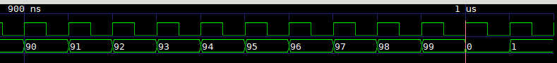

date: 2019-11-17
abstract: In this post I use basic formal verification to prove that all 6 versions of counters I created last time work as expected.
image: 016.png

# Formal verification

In the [last post](015-How-to-count) I wrote several implementations of very simple module.
I think all the versions do what they should, but one cannot be sure
until it's tested... or verified.

This will be my first try of formal verification. I'm inspired by reading
[this presentation](http://zipcpu.com/tutorial/lsn-03-fsm.pdf).
There is also [longer introduction to formal methods](http://zipcpu.com/blog/2017/10/19/formal-intro.html)
and there are [other tutorial articles](http://zipcpu.com/tutorial/)
on [zipcpu.com](http://zipcpu.com) site,
all of which I recommend.

To have all required tools I followed
[instructions on SymbiYosys site](https://symbiyosys.readthedocs.io/en/latest/quickstart.html) and created [Docker image](https://hub.docker.com/repository/docker/tocisz/verilog-toolbox).

## Counting modulo 100

Let's recall first test problem from the [last post](015-How-to-count):

> Input: clock signal
>
> Output: Counter that goes from 0 to 99 cyclically.

How can we verify that output is valid?

First of all, value of output has to be less than 100 all the time.
This can be written as:

```Verilog
always @(posedge clk) begin
  assert(c100 < 100);
end
```

Second, order is important. Value in the next clock cycle, should be
incremented by one. We may write something like:
```Verilog
always @(posedge clk) begin
  assert($past(c100) + 1 == c100);
end
```

When we run `sby` tool with appropriate arguments, we get the following
result:

```
SBY 15:20:07 [c100_c100_if] engine_0: ##   0:00:00  Checking assertions in step 1..
SBY 15:20:07 [c100_c100_if] engine_0: ##   0:00:00  BMC failed!
SBY 15:20:07 [c100_c100_if] engine_0: ##   0:00:00  Assert failed in c100_if: c100-formal.v:7
SBY 15:20:07 [c100_c100_if] engine_0: ##   0:00:00  Writing trace to VCD file: engine_0/trace.vcd
```

It failed in the first step!

The problem is with `$past(c100)` value in the first clock cycle. There
was no past value, so `sby` assumes some (random?) value and it fails.
Standard solution is not to check assertions that reference past values
in the first clock cycle. This can be done by defining helper register:
```Verilog
reg f_past_valid;
initial	f_past_valid = 1'b0;
always @(posedge clk)
	f_past_valid <= 1'b1;
```

Now we can correct our mistake:
```Verilog
always @(posedge clk) begin
  if (f_past_valid)
    assert($past(c100) + 1 == c100);
end
```

It failed again! But this time in step number 101.

```
SBY 15:30:14 [c100_c100_if] engine_0: ##   0:00:01  Checking assumptions in step 101..
SBY 15:30:14 [c100_c100_if] engine_0: ##   0:00:01  Checking assertions in step 101..
SBY 15:30:14 [c100_c100_if] engine_0: ##   0:00:01  BMC failed!
SBY 15:30:14 [c100_c100_if] engine_0: ##   0:00:01  Assert failed in c100_if: c100-formal.v:7
SBY 15:30:14 [c100_c100_if] engine_0: ##   0:00:01  Writing trace to VCD file: engine_0/trace.vcd
```

We can look at the trace file, to see what happened.



The mistake is in the assertion. Value goes back to 0 after 99 (as it should),
but we asserted it should always increment. Correct version below:
```Verilog
always @(posedge clk) begin
  if (f_past_valid)
    assert(($past(c100) + 1) % 100 == c100);
end
```

## One more check

Second problem from the [last post](015-How-to-count) is as follows:

> Input: clock signal
>
> Output 1: Counter that goes from 0 to 99 cyclically.
>
> Output 2: As above, but modulo 9.


*Output 1* is the same as in the first problem. *Output 2* is not specified
well.

Does it mean:

1. Value "as above", but modulo 9.
2. Counter that goes from 0 to 8 cyclically.

When implementing I assumed first version. The check is very simple:
```Verilog
always @(posedge clk) begin
  assert(c100 % 9 == c9);
end
```

## How to run tests?

I created separate files for `f_past_valid` definition (`sby-common.v`),
checks for `c100` output (`c100-formal.v`)
and checks for `c9` output (`c9-formal.v`).

This way, I can include checks easily in verified modules:
```Verilog
`ifdef FORMAL
`include "sby-common.v"
`include "c100-formal.v"
`include "c9-formal.v"
`endif
```

To run `sby` tool we also need some `.sby` file with configuration.
My `c100.sby` file is:
```options
[tasks]
c100_mod
c100_if
c100_mod_mod9
c100_mod_mod9_comb
c100_if_mod9
c100_if_if

[options]
mode bmc
depth 120

[engines]
smtbmc

[script]
c100_mod: read -formal c100_mod.v
c100_mod: prep -top c100_mod

c100_if: read -formal c100_if.v
c100_if: prep -top c100_if

c100_mod_mod9: read -formal c100_mod_mod9.v
c100_mod_mod9: prep -top c100_mod_mod9

c100_mod_mod9_comb: read -formal c100_mod_mod9_comb.v
c100_mod_mod9_comb: prep -top c100_mod_mod9_comb

c100_if_mod9: read -formal c100_if_mod9.v
c100_if_mod9: prep -top c100_if_mod9

c100_if_if: read -formal c100_if_if.v
c100_if_if: prep -top c100_if_if

[files]
sby-common.v
c100_mod.v
c100_if.v
c100-formal.v
c9-formal.v
c100_mod_mod9.v
c100_mod_mod9_comb.v
c100_if_mod9.v
c100_if_if.v
```

Task is a named subset of configuration. I used this mechanism
to have one `.sby` file for all 6 versions.
To know what other options mean, please read [sby tool documentation](https://symbiyosys.readthedocs.io/en/latest/reference.html).

Now to test e.g. `c100_mod` module, we can run:
```Bash
sby -f c100.sby c100_mod
```

## Conclusions

It was easy. Certainly, I have just scratched the surface.
Things get more interesting when we have some unspecified inputs
and we want to prove that system will work for all of them.

I think formal verification is a  great tool
to write specification of some protocol
that modules need to comply, like proper use of dynamic RAM
or some communication bus.
